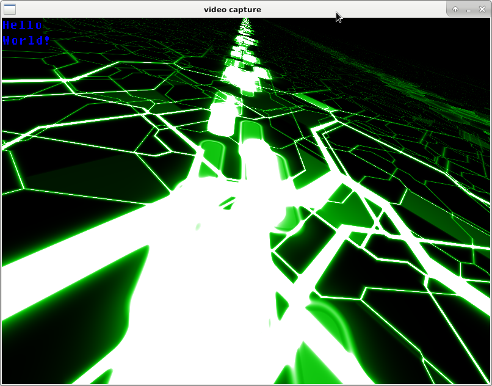
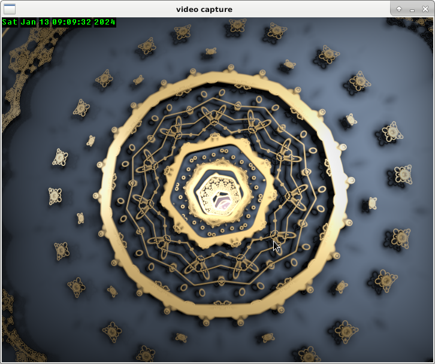

# Offscreen OpenGL/GLES rendering

These examples programs show:

* how to do OpenGL/GLES rendering without any windowing system,
* how to retrieve the video and play it in a window
* how to take video snapshots in PNG or JPEG. For JPEG it uses hardware acceleration for picture encoding.

Should work on headless system provided that `/dev/dri/renderD128` device exists.

Code shown here:

* is inspired by work found [here](https://github.com/elima/gpu-playground.git)
* uses glText from [here](https://github.com/vallentin/glText.git)
* uses shaders found [here](https://glslsandbox.com)
* uses huge code chunks from [libva-utils](https://github.com/intel/libva-utils).
* uses a tiny TCL interpreter from [picol](https://github.com/dbohdan/picol).

There are 7 distinct programs:

* **offscreen**: does the rendering and stores the images (RGBA32 pixels) in a memory mapped file (defaults to `/tmp/frame`). Images are generated at a given frame rate (default to 20 fps).
* **grab-png**: takes a screenshot in PNG by reading the file filled by **offscreen**.
* **grab-jpeg**: takes a screenshot in JPEG by reading the file filled by **offscreen**. It uses `vaapi` (Video Acceleration API) to delegate JPEG computation to the hardware.
* **h264enc**: Encode generated frames as an h264 raw video file.
* **h265enc**: Encode generated frames as an h265 raw video file.
* **h264streamer**: Create RTSP server and RTP streams h264 raw video file. Used to stream output of **h264enc**
* **sdl-win**: Read images at a given framerate (default to 20) from the file written by **offscreen** which is memory mapped.

Apart for `sdl-win` it is easier to start `grab-png`, `grab-jpeg`, `h264enc` and `h265enc` from `offscreen` (see below).

## Usage

### offscreen

This program performs hardware accelerated video rendering using GL fragment shaders.

    $ offscreen -?
    usage: ./offscreen [-w width] [-h height] [-f framerate] [-o /path/to/file] [-s /path/to/fragment-shader]
        -?                        Print this help message.
        -h height                 Desired image height. Defaults to 720
        -w width                  Desired image width. Defaults to 576
        -f fps                    Number of images per second. Defaults to 20.
        -o /path/to/file          Path of mmap-ed file that will hold image. Defaults to '/tmp/frame'.
        -s /path/to/file          Path of of fragent shader. Defaults to 'shaders/plasma.frag'

There is a crude command interface which is based on a tiny TCL interpreter. If started from a terminal the program displays a prompt.

    $ ./offscreen 
    The output file was opened successfully.
    The output file was mapped to memory successfully.
    offscreen renderer cli. Type 'help' to see available commands.
    => help
    colorspace ?rgb/yuv?
    execbg command ?arg1? ... ?argn?
    fps ?frame-per-second?
    kill ?add/rm pid?
    message ?msg?
    mouse ?x y?
    shader ?/path/to/fragment-shader?
    stats
    width
    height
    help ?topic?
    quit ?status?

    => help fps
    With no argument, returns current video framerate. Otherwise sets framerate according to argument. Valid values are integer between 1 and 100.

There are commands for taking snapshots (jpeg and png) and recording video, at `offscreen` prompt enter:

    => png /path/to/capture.png
    => jpeg /path/to/capture.jpeg
    => h264enc /path/to/video.264 1000  ;# will record 1000 video frames
    => h265enc /path/to/video.265 1000  ;# will record 1000 video frames

Note that jpeg, h264 and h265 use hardware acceleration using VAAPI.

### sdl-win

    $ ./sdl-win -?
    usage: ./sdl-win [-?] -i file [-f fps] [-x x] [-y y] [-w width] [-h height]
        -?                        Prints this message.
        -i                        Set input video frame file (default /tmp/frame).
        -f                        Set the video framerate (default 20).
        -w                        Set the width of the image (default 720).
        -h                        Set the height of the image (default 576).
        -x                        Set the x position of the window (default 100).
        -y                        Set the y position of the window (default 100).

### grap-png

    $ ./grab-png -?
    usage: ./grab-png [-?] -i file -o file [-w width] [-h height]
        -?                        Prints this message.
        -i                        Set input video frame file (default /tmp/frame).
        -o                        Set output PNG file name (default /tmp/capture.png).
        -w                        Set the width of the image (default 720).
        -h                        Set the height of the image (default 576).
        -s                        Encode input on SIGUSR1 signal. Wait at most 10 sec for signal.

It is easier to start `grab-png` from `offscreen` using the `png` command like this:

    $ ./offscreen
    ==> png /path/to/capture.png
    ==> quit

It will start `grab-png`, change colorspace to RGB, send a SIGUSR1 signal to `grab-jpeg` process.

### grab-jpeg

    $ ./grab-jpeg -?
    usage: ./grab-jpeg [-?] -i file -o file [-w width] [-h height]
        -?                        Prints this message.
        -i                        Set input video frame file (default /tmp/frame).
        -o                        Set output JPEG file name (default /tmp/capture.jpeg).
        -w                        Set the width of the image (default 720).
        -h                        Set the height of the image (default 576).
        -f                        Set 4CC value 0(I420)/1(NV12)/2(UYVY)/3(YUY2)/4(Y8)/5(RGBA) (default 5).
        -q                        Set quality of the image (default 50).
        -s                        Encode input on SIGUSR1 signal. Wait at most 10 sec for signal.
	
    Example: ./grab-jpeg -w 1024 -h 768 -i input_file.yuv -o output.jpeg -f 0 -q 50

It is easier to start `grab-jpeg` from `offscreen` using the `png` command like this:

    $ ./offscreen
    ==> jpeg /path/to/capture.jpeg
    ==> quit

It will start `grab-jpeg`, change colorspace to YUV, send a SIGUSR1 signal to `grab-jpeg` process.

For the moment, only 4CC RGBA is supported. But it is not real RGBA, you need to perform rendering in YUV colorspace by entering `colorspace yuv` at `offscreen` command prompt.

### h264enc

    $ ./h264enc -?
    ./h264encode <options>
       -w <width> -h <height>
       -framecount <frame number>
       -n <frame number>
	  if set to 0 and srcyuv is set, the frame count is from srcuv file
       -o <coded file>
       -f <frame rate>
       --intra_period <number>
       --idr_period <number>
       --ip_period <number>
       --bitrate <bitrate>
       --initialqp <number>
       --minqp <number>
       --rcmode <NONE|CBR|VBR|VCM|CQP|VBR_CONTRAINED>
       --srcyuv <filename> load YUV from a file
       --entropy <0|1>, 1 means cabac, 0 cavlc
       --profile <BP|MP|HP>
       --low_power <num> 0: Normal mode, 1: Low power mode, others: auto mode

It is easier to start `h264enc` from `offscreen` using the `h264` command like this:

    $ ./offscreen
    ==> h264 /path/to/video.h264 1000  ;# will record 1000 video frames

    INPUT:Try to encode H264...
    INPUT: RateControl  : CBR
    INPUT: Resolution   : 720x576, 1000 frames
    INPUT: FrameRate    : 20
    INPUT: Bitrate      : 1990656
    INPUT: Slices       : 1
    INPUT: IntraPeriod  : 30
    INPUT: IDRPeriod    : 30
    INPUT: IpPeriod     : 1
    INPUT: Initial QP   : 26
    INPUT: Min QP       : 0
    INPUT: Source YUV   : /tmp/frame (fourcc NV12)
    INPUT: Coded Clip   : /path/to/video.h264

    libva info: VA-API version 1.4.0
    libva info: va_getDriverName() returns 0
    libva info: Trying to open /usr/lib/x86_64-linux-gnu/dri/i965_drv_video.so
    libva info: Found init function __vaDriverInit_1_4
    libva info: va_openDriver() returns 0
    Using EntryPoint - 6 
    Use profile VAProfileH264High
    Support rate control mode (0x96):CBR VBR CQP 
    Support VAConfigAttribEncPackedHeaders
    Support packed sequence headers
    Support packed picture headers
    Support packed slice headers
    Support packed misc headers
    Support 4 RefPicList0 and 1 RefPicList1
    Support 32 slices
    Support VAConfigAttribEncSliceStructure
    Support VA_ENC_SLICE_STRUCTURE_ARBITRARY_MACROBLOCKS
	  \P    00000999(007333 bytes coded)

    PERFORMANCE:   Frame Rate           : 19.66 fps (1000 frames, 50868 ms (50.87 ms per frame))
    PERFORMANCE:   Compression ratio    : 73:1
    PERFORMANCE:     Processing         : 12138 ms (12.14, 23.86% percent)
    PERFORMANCE:     UploadPicture      : 346 ms (0.35, 0.68% percent)
    PERFORMANCE:     vaBeginPicture     : 6 ms (0.01, 0.01% percent)
    PERFORMANCE:     vaRenderHeader     : 45 ms (0.04, 0.09% percent)
    PERFORMANCE:     vaEndPicture       : 2130 ms (2.13, 4.19% percent)
    PERFORMANCE:     vaSyncSurface      : 860 ms (0.86, 1.69% percent)
    PERFORMANCE:     SavePicture        : 183 ms (0.18, 0.36% percent)
    PERFORMANCE:     Others             : 47298 ms (47.30, 92.98% percent)

    ==> quit

It will start `h264enc`, change colorspace to YUV, send a SIGUSR1 signal to `h264enc` process after each new frame is ready.

### h265enc

    $ ./h265enc -?
    ./hevcencode <options>
       -w <width> -h <height>
       -framecount <frame number>
       -n <frame number>
       -o <coded file>
       -f <frame rate>
       --intra_period <number>
       --idr_period <number>
       --ip_period <number>
       --bitrate <bitrate> Kbits per second
       --initialqp <number>
       --minqp <number>
       --rcmode <NONE|CBR|VBR|VCM|CQP|VBR_CONTRAINED>
       --syncmode: sequentially upload source, encoding, save result, no multi-thread
       --srcyuv <filename> load YUV from a file
       --fourcc <NV12|IYUV|YV12> source YUV fourcc
       --profile 1: main 2 : main10
       --p2b 1: enable 0 : disalbe(defalut)
       --lowpower 1: enable 0 : disalbe(defalut)

It is easier to start `h265enc` from `offscreen` using the `h265` like `h264` command does for `h264enc`.

### h264streamer

    $ ./h264streamer -h
    usage: ./h264streamer [-i /path/to/file] [-s stream-name]
	-?                        Print this help message.
	-i /path/to/file          Path to input raw h264 vide file. Defaults to 'test.h264'.
	-s stream-name            Name of stream used for RTSP URL. Defaults to 'testStream

This program can stream an h264 elementary stream (sequence of NAL units) generated using **h264enc**.

Using a FIFO (named pipe created with `mkfifo` as output of **h264enc** and as input of **h264streamer** a realtime h264-encoder-streamer pipeline is created. This is what does the offscreen command `h264stream`.

    $ ./offscreen 
    The output file was opened successfully.
    The output file was mapped to memory successfully.
    offscreen renderer cli. Type 'help' to see available commands.
    => h264stream 10000

    INPUT:Try to encode H264...
    INPUT: RateControl  : CBR
    INPUT: Resolution   : 720x576, 10000 frames
    INPUT: FrameRate    : 20
    INPUT: Bitrate      : 1990656
    INPUT: Slices       : 1
    INPUT: IntraPeriod  : 30
    INPUT: IDRPeriod    : 30
    INPUT: IpPeriod     : 1
    INPUT: Initial QP   : 26
    INPUT: Min QP       : 0
    INPUT: Source YUV   : /tmp/frame (fourcc NV12)
    INPUT: Coded Clip   : /tmp/h264fifo

    libva info: VA-API version 1.4.0
    libva info: va_getDriverName() returns 0
    libva info: Trying to open /usr/lib/x86_64-linux-gnu/dri/i965_drv_video.so
    libva info: Found init function __vaDriverInit_1_4
    libva info: va_openDriver() returns 0
    Using EntryPoint - 6 
    Use profile VAProfileH264High
    Support rate control mode (0x96):CBR VBR CQP 
    Support VAConfigAttribEncPackedHeaders
    Support packed sequence headers
    Support packed picture headers
    Support packed slice headers
    Support packed misc headers
    Support 4 RefPicList0 and 1 RefPicList1
    Support 32 slices
    Support VAConfigAttribEncSliceStructure
    Support VA_ENC_SLICE_STRUCTURE_ARBITRARY_MACROBLOCKS
    --------------------------------------------
    Note RTSP URL below to play stream
    --------------------------------------------
    --------------------------------------------
    => Play this stream using the URL "rtsp://192.168.1.30:8554/h264"
    Beginning streaming...
    Beginning to read from file...
	  \P    00000279(011028 bytes coded)

Note the name of the coded video which is actually a FIFO `/tmp/h264fifo`.

To view the stream use `vlc rtsp://192.168.1.30:8554/h264`. VLC will buffer the stream for about 1 second resulting in a 1 second delay.

## Demo

In a first terminal run `offscreen`:

   $ ./offscreen -w 800 -h 600 -s shaders/voronoi.frag

In a second terminal run `sdl-win` which will displayed an animated graphic:

   $ ./sdl-win -w 800 -h 600

You should see something like this:

In the first terminal, the `offscreen` prompt `=>` is displayed.
Type `help` to see the list of available commands and `help <<command>>` to get help on a specific command..

Framerate and shader can be changed dynamically using `fps` and `shader` command.
The message printed on the video can be changed using `message` command.

## Gallery

### Plasma

### Circles

### City

### Cues

### eurotunnel

### nested

### pavage

### pipes

### stars

## Building

Type `make` to build all the programs.

There are some prerequisites, given here on debian 10 buster used during development.

* `libpng-dev`
* `libsdl2-dev`
* `libgbm-dev`
* `libgles2-mesa-dev`
* `libegl1-mesa-dev`
* `liva-dev`

## Windows WSL2

It is possible to use the `offscreen` program under WSL2 (tested on ubuntu-20.04).
On this system the device `/dev/dri/renderD128` is present and can be used.
Probably mesa will not be able to initialize properly without help and you will get a message like this:

    MESA-LOADER: failed to open vgem: /usr/lib/dri/vgem_dri.so: cannot open shared object file: No such file or directory (search paths /usr/lib/x86_64-linux-gnu/dri:\$${ORIGIN}/dri:/usr/lib/dri, suffix _dri)
    failed to load driver: vgem

To circumvent this issue, you need to help mesa to choose the right libray to load. For example:

    export MESA_LOADER_DRIVER_OVERRIDE=i965

`grab-png` which does not rely on graphic hardware (doesn't use `/dev/dri/renderD128`) works out of the box.

WSL2 has a builtin graphical wayland based backend named `wslg` which can be used to run X11 program. `sdl-win` wasn't working on it at the tie of writing. It worked and has been tested using `MobaXterm X11 server` with moba version 21.2, the following server modes works (others don't):

* "Windowed mode": X11 server constrained to a single container window
* "Windowed mode with DWM": X11 server with DWM desktop in a container window
* "Windowed mode with Tvwm desktop": X11 server and Fvwm desktop in a container window
* "Rootless": Transparent X11 server with Fvwm window borders (experimantal)

For MobaXTerm X11 server to work package `xauth` must be installed and environment variable `XAUTHORITY` needs to be defined:

   $ export XAUTHORITY=/home/wsluser/.Xauthority

## VAAPI video encoding

Starting point is [libva-utils](https://github.com/intel/libva-utils)

For `i965` driver, the following package from `non-free` section needs to be installed.
    $ sudo apt-get install i965-va-driver-shaders

## Future directions

* Add circular buffer of frames. At least 2.
* Add RTP raw video streaming as an external program which consumes frames (like `sdl-win` and `grap-png`).
* Add H264/H265 video RTP streaming backend using `vaapi` + `live555`  ==> WORK in PROGRESS
* Add an SDL based hardware accelerated video decoder.

